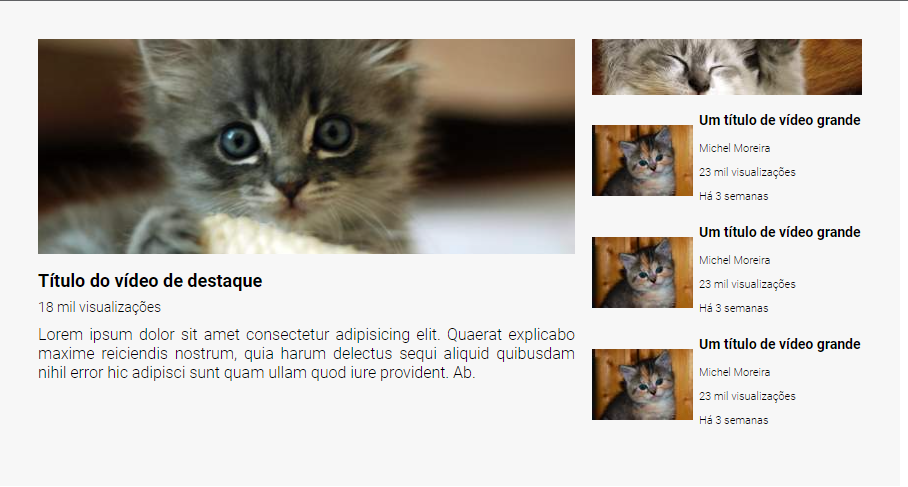

# Layout de tela de vídeo símile ao Youtube

Nesse repositório, aplico os conhecimentos de *HTML* e *CSS*, sobretudo, com o uso das ferramentas de display **grid** e **flexbox**, responsáveis por definirem o layout de uma página.

Temos:

- Um vídeo em destaque com suas respectivas informações;
- Ao lado uma faixa destinada à propaganda; e
- Uma área destinada à lista de vídeos relacionados ou sugeridos.

## Imagens apenas ilustrativas, e informações fictícias
